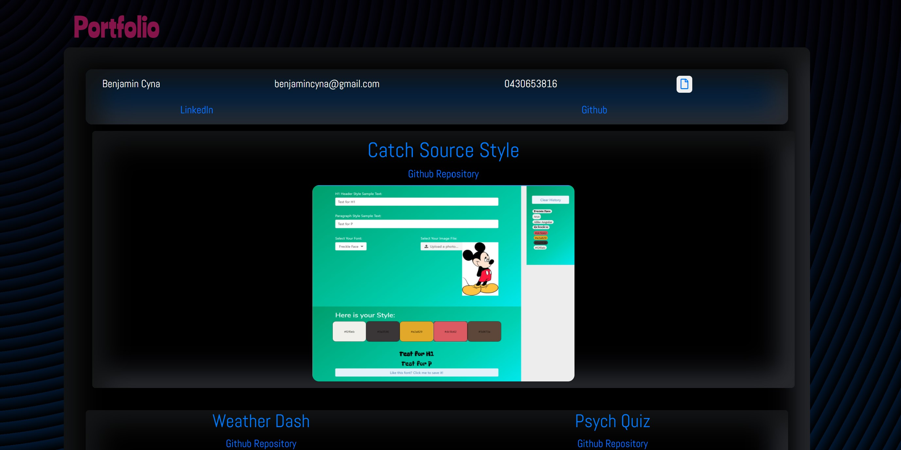

# my-portfolio

## [Working Product](https://bencyna.github.io/my-portfolio/portfolio.html)

## Motivation
This project has been developed to provide a portfolio for potential future employees to gain an insight of who I am as a person and what I could contribute to a company. Using bootsrap utilises the pre-exisitng css frameworks to allow for mobile responsive code. This project showcases my current learning capabilities and ability to learn new skills over time. 

## Installation
Added links to:
 - reset.css for cross-browser compatability 
 - bootsrap for implementation of existing css framework
 - style.css for further personalised changes
 - googlefonts for new font use
 - viewport tag for mobile responisveness

 Also:
- Created grid system on index.html, portfolio.html and contact.html
- Incorporated images 
- Utilisation of bootsrtap to create contact form 
- Implementation of own information and edits in both html and css files to suit website
- Added responsive footer
- Using css to add styles 
- clickable links to my resume, and linkedin and github profiles

## Usage

The above image shows the code used to create the background, the styling of this work is mainly to show my skills as a creator. The result of this code can be seen in the below image. 

Here are where my work is shown, there are clickable links to my resume, linkedin and github and examples with clickable links to github and the page itself.

## Credits
- [Boostrap](https://getbootstrap.com/)
- [Google Fonts](https://fonts.google.com/)
- [Fonts.Aweseome](https://fontawesome.com/)
- [Magic Patterns](https://www.magicpattern.design/tools/css-backgrounds)

## Licnece 
MIT License

Copyright (c) [2020] [Ben Cyna]

Permission is hereby granted, free of charge, to any person obtaining a copy
of this software and associated documentation files (the "Software"), to deal
in the Software without restriction, including without limitation the rights
to use, copy, modify, merge, publish, distribute, sublicense, and/or sell
copies of the Software, and to permit persons to whom the Software is
furnished to do so, subject to the following conditions:

The above copyright notice and this permission notice shall be included in all
copies or substantial portions of the Software.

THE SOFTWARE IS PROVIDED "AS IS", WITHOUT WARRANTY OF ANY KIND, EXPRESS OR
IMPLIED, INCLUDING BUT NOT LIMITED TO THE WARRANTIES OF MERCHANTABILITY,
FITNESS FOR A PARTICULAR PURPOSE AND NONINFRINGEMENT. IN NO EVENT SHALL THE
AUTHORS OR COPYRIGHT HOLDERS BE LIABLE FOR ANY CLAIM, DAMAGES OR OTHER
LIABILITY, WHETHER IN AN ACTION OF CONTRACT, TORT OR OTHERWISE, ARISING FROM,
OUT OF OR IN CONNECTION WITH THE SOFTWARE OR THE USE OR OTHER DEALINGS IN THE
SOFTWARE.

## Future Development 
Allow submit button on contact to automatically contact my email address
