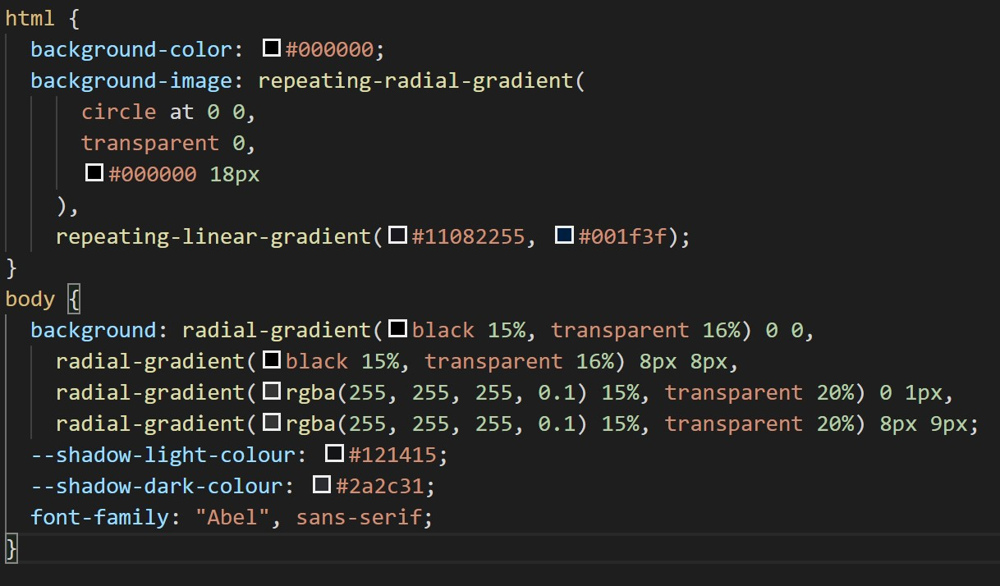

# My Portfolio

## Description

This project has been developed to provide a portfolio for potential future employees to gain an insight of who I am as a person and what I could contribute to a company. Using bootsrap utilises the pre-exisitng css frameworks to allow for mobile responsive code. This project showcases my current learning capabilities and ability to learn new skills.

## Table Of Contents

- [Installation](##Installation)
- [Usage](##Usage)
- [License](##License)
- [Contributing](##Contributing)
- [Tests](##Tests)
- [Questions](##Questions)

## Installation

Added a reset.css for cross-browser compatiability, bootstrap for implementation of existing css, style.css for further styling changes. There was also use of google fonts and viewport tags for styling and mobile responsiveness. To put these together I also made the grid bootstrap system for each page, added images, contact form, and clickable links to my past projects and resume, linkedIn and github profiles

## Usage

The above image shows the code used to create the background, the styling of this work is mainly to show my skills as a creator. The result of this code can be seen in the below image.

Here are where my work is shown, there are clickable links to my resume, linkedin and github and examples with clickable links to github and the page itself.

## Credits

- [Boostrap](https://getbootstrap.com/)
- [Google Fonts](https://fonts.google.com/)
- [Fonts.Aweseome](https://fontawesome.com/)
- [Magic Patterns](https://www.magicpattern.design/tools/css-backgrounds)

  ## License

  This project is covered under the BSD License

  ## Contributing

  [bencyna](https://github.com/bencyna/)

  ## Tests

  go to https://bencyna.github.io/my-portfolio/portfolio.html

  ## Questions

  If you have any questions about this project, you can veiw my github account at github.com/bencyna/ or email me at benjamincyna@gmail.com
